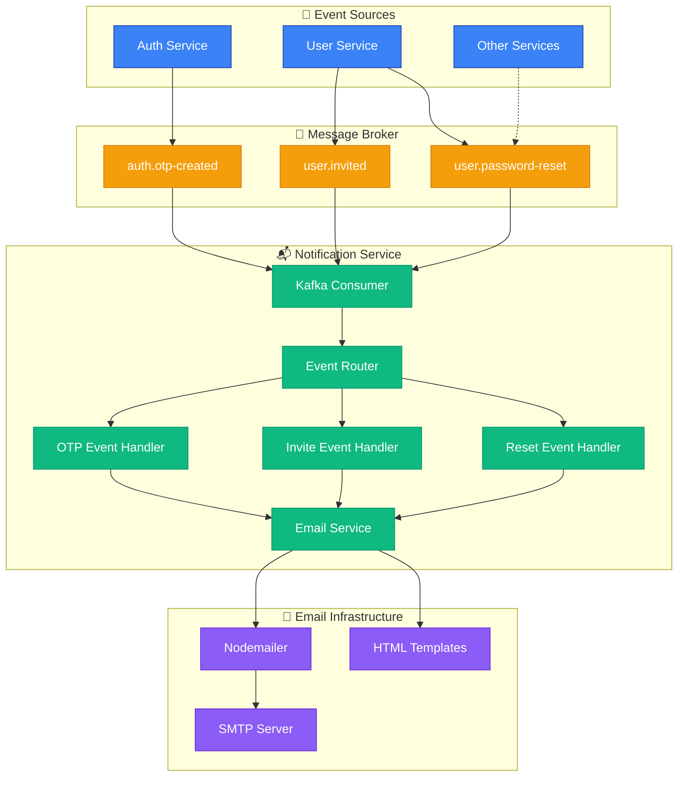

<div align="center">
  <h1>📬 Fleet OS Notification Service</h1>
  <p>
    <strong>Event-Driven Email & Notification Microservice</strong>
  </p>

[](https://opensource.org/licenses/ISC)


  <p>
    <a href="#-overview">Overview</a> •
    <a href="#-architecture">Architecture</a> •
    <a href="#-key-features">Features</a> •
    <a href="#-technology-stack">Tech Stack</a> •
    <a href="#-getting-started">Getting Started</a> •
    <a href="#-event-types">Events</a>
  </p>
</div>

---

## 📖 Overview

The **Fleet OS Notification Service** is an event-driven microservice responsible for sending transactional emails and managing notifications across the Fleet OS platform. It consumes events from Apache Kafka and dispatches emails using Nodemailer with HTML templates.

### 🎯 Purpose

This service operates as a dedicated notification hub, handling:

- **Event-Driven Email Delivery**: Process events from Kafka topics
- **Transactional Emails**: OTP verification, user invitations, password resets
- **Template-Based Emails**: HTML email templates for professional communications
- **Asynchronous Processing**: Non-blocking event consumption
- **Resilient Delivery**: Automatic retry mechanisms for failed sends

---

## ✨ Key Features

### 📧 Email Service

- **SMTP Integration**: Configurable email provider (Gmail, SendGrid, etc.)
- **HTML Templates**: Professional, branded email templates
- **Template Variables**: Dynamic content injection
- **Attachment Support**: Send files with emails
- **HTML & Plain Text**: Dual format for compatibility

### 🔔 Event Handlers

- **OTP Verification Emails**: Send verification codes for user registration
- **User Invitation Emails**: Welcome new users to the platform
- **Password Reset Emails**: Secure password recovery flow
- **Notification Events**: Extensible handler system

### ⚡ Event-Driven Architecture

- **Kafka Integration**: Subscribe to multiple topics
- **Event Processing**: Asynchronous message consumption
- **Error Handling**: Dead letter queue support
- **Retry Logic**: Automatic reconnection on failures
- **Graceful Shutdown**: Clean Kafka consumer disconnection

### 🛡️ Reliability Features

- **Health Checks**: `/healthz` endpoint for monitoring
- **Structured Logging**: Winston-based logging with levels
- **Environment Validation**: Zod schema validation
- **Connection Retry**: Automatic Kafka reconnection
- **Error Recovery**: Graceful error handling

---

## 🏛 Architecture

Built as a **Kafka Consumer** with event-driven processing.



### 🧠 Design Patterns

- **Event-Driven Architecture**: Decoupled communication via Kafka
- **Publisher-Subscriber**: Services publish events, notification consumes
- **Template Pattern**: Reusable email templates
- **Strategy Pattern**: Different handlers for different event types
- **Retry Pattern**: Automatic reconnection on failures

---

## 🛠 Technology Stack

| Category          | Technology                                                                                                | Purpose                    |
| :---------------- | :-------------------------------------------------------------------------------------------------------- | :------------------------- |
| **Runtime**       |    | JavaScript runtime         |
| **Language**      |  | Type-safe development      |
| **Framework**     |  | Minimal web server (health endpoint) |
| **Message Broker** |   | Event streaming platform   |
| **Email**         | **Nodemailer**                                                                                            | Email sending library      |
| **Database**      |     | Event logging (optional)   |
| **Validation**    | **Zod**                                                                                                   | Environment validation     |
| **Logging**       | **Winston**                                                                                               | Structured logging         |
| **Testing**       | **Jest**                                                                                                  | Unit testing               |

---

## 📂 Project Structure

```
fleet-os-notification-service/
├── src/
│   ├── config/                      # ⚙️ Configuration
│   │   ├── email.ts                 # Email transport setup
│   │   ├── kafka.ts                 # Kafka consumer config
│   │   ├── logger.ts                # Winston logger setup
│   │   ├── mongo.connect.ts         # MongoDB connection
│   │   ├── validate-env.ts          # Environment validation
│   │   └── init-config.ts           # Config initialization
│   │
│   ├── services/                    # 📬 Core services
│   │   ├── email.service.ts         # Email sending logic
│   │   ├── kafka-consumer.service.ts # Kafka event consumption
│   │   └── event-handlers/          # Event processors
│   │       └── otp-handler.ts       # OTP email handler
│   │
│   ├── templates/                   # 📧 Email templates
│   │   └── otp-email.html           # OTP verification template
│   │
│   ├── app.ts                       # Express app setup
│   └── index.ts                     # Server entry point
│
├── .env.example                     # Environment template
├── Dockerfile                       # Production container
└── package.json
```

---

## 🚀 Getting Started

### Prerequisites

- **Node.js** >= 20.x
- **pnpm** >= 9.x
- **Apache Kafka** (for event streaming)
- **SMTP Server** (Gmail, SendGrid, Mailgun, etc.)

### Installation

1. **Clone the repository**

```bash
git clone https://github.com/ijas9118/fleet-os-notification-service.git
cd fleet-os-notification-service
```

2. **Install dependencies**

```bash
pnpm install
```

3. **Configure environment**

```bash
cp .env.example .env
# Edit .env with your configuration
```

**Required Environment Variables:**

```env
# Server
NODE_ENV=development
PORT=3005

# Email (SMTP)
EMAIL_HOST=smtp.gmail.com
EMAIL_PORT=587
EMAIL_USER=your-email@gmail.com
EMAIL_PASSWORD=your-app-password
EMAIL_FROM="Fleet OS <noreply@fleetos.com>"

# Kafka
KAFKA_BROKERS=localhost:9092
KAFKA_GROUP_ID=notification-service
KAFKA_CLIENT_ID=notification-service-01

# MongoDB (optional, for logging)
DATABASE_URL=mongodb://localhost:27017/fleet-os-notifications

# Frontend URL
CLIENT_URL=http://localhost:3000
```

4. **Run development server**

```bash
pnpm dev
```

The service will start on `http://localhost:3005` and begin consuming Kafka events.

### Running Tests

```bash
# Run all tests
pnpm test

# Watch mode
pnpm test:watch

# Generate coverage report
pnpm test:coverage
```

### Building for Production

```bash
# Type check
pnpm typecheck

# Build
pnpm build

# Start production server
pnpm start
```

---

## 📨 Kafka Event Types

The service subscribes to the following Kafka topics:

### OTP Verification Event

**Topic:** `auth.otp-created`

**Event Payload:**
```typescript
{
  type: "otp-created";
  data: {
    email: string;
    otp: string;
    tenantName?: string;
  };
}
```

**Email Template:** OTP verification code

---

### User Invitation Event

**Topic:** `user.invited`

**Event Payload:**
```typescript
{
  type: "user-invited";
  data: {
    email: string;
    invitationLink: string;
    invitedBy: string;
    role: string;
  };
}
```

**Email Template:** User invitation with setup link

---

### Password Reset Event

**Topic:** `user.password-reset`

**Event Payload:**
```typescript
{
  type: "password-reset";
  data: {
    email: string;
    resetLink: string;
    userName: string;
  };
}
```

**Email Template:** Password reset instructions

---

## 📧 Email Templates

Email templates are HTML-based with CSS styling. They support variable substitution for dynamic content.

### Template Variables

Templates use double curly braces for variables:

```html
<h1>Hello {{userName}}!</h1>
<p>Your verification code is: <strong>{{otp}}</strong></p>
```

### Creating New Templates

1. Add HTML template file in `src/templates/`
2. Use semantic HTML and inline CSS
3. Define template variables
4. Create event handler in `src/services/event-handlers/`
5. Register handler in `kafka-consumer.service.ts`

---

## 🔄 Adding New Event Handlers

1. **Create Event Handler**

```typescript
// src/services/event-handlers/my-handler.ts
import { EmailService } from '../email.service';

export async function handleMyEvent(data: any) {
  const emailService = new EmailService();
  
  await emailService.sendEmail({
    to: data.email,
    subject: 'My Subject',
    template: 'my-template',
    variables: {
      userName: data.name,
      customData: data.value,
    },
  });
}
```

2. **Register in Kafka Consumer**

```typescript
// src/services/kafka-consumer.service.ts
case 'my-event-type':
  await handleMyEvent(message.data);
  break;
```

3. **Add Template**

Create `src/templates/my-template.html` with your HTML content.

---

## 🏥 Health Check

The service exposes a health check endpoint:

```
GET http://localhost:3005/healthz
```

**Response:**
```json
{
  "status": "ok"
}
```

Use this endpoint for:
- Load balancer health checks
- Kubernetes liveness/readiness probes
- Monitoring systems

---

## 🔒 Security Considerations

- **Environment Variables**: Never commit `.env` files
- **SMTP Credentials**: Use app-specific passwords, not account passwords
- **Email Validation**: Validate recipient emails before sending
- **Rate Limiting**: Implement sending limits to prevent abuse
- **Template Injection**: Sanitize all template variables
- **TLS/SSL**: Always use secured SMTP connections

---

## 📊 Monitoring & Logging

### Logging Levels

- `error`: Failed email sends, Kafka disconnections
- `warn`: Retry attempts, configuration issues
- `info`: Successful sends, consumer status
- `debug`: Event processing details

### Recommended Metrics

- **Email Send Rate**: Emails sent per minute
- **Delivery Success Rate**: Successful vs failed sends
- **Event Processing Time**: Time to process each event
- **Kafka Lag**: Consumer group lag
- **Error Rate**: Failed sends per hour

---

## 📊 Environment Variables

| Variable           | Description                  | Required | Default       | Example                           |
| :----------------- | :--------------------------- | :------- | :------------ | :-------------------------------- |
| `NODE_ENV`         | Environment mode             | No       | `development` | `production`                      |
| `PORT`             | Server port                  | No       | `3005`        | `3005`                            |
| `EMAIL_HOST`       | SMTP server host             | Yes      | -             | `smtp.gmail.com`                  |
| `EMAIL_PORT`       | SMTP server port             | Yes      | -             | `587`                             |
| `EMAIL_USER`       | SMTP username                | Yes      | -             | `notifications@fleetos.com`       |
| `EMAIL_PASSWORD`   | SMTP password/app password   | Yes      | -             | `your-app-password`               |
| `EMAIL_FROM`       | Default sender address       | Yes      | -             | `Fleet OS <noreply@fleetos.com>`  |
| `KAFKA_BROKERS`    | Kafka broker URLs            | Yes      | -             | `localhost:9092`                  |
| `KAFKA_GROUP_ID`   | Consumer group ID            | Yes      | -             | `notification-service`            |
| `KAFKA_CLIENT_ID`  | Consumer client ID           | Yes      | -             | `notification-service-01`         |
| `DATABASE_URL`     | MongoDB connection string    | No       | -             | `mongodb://localhost:27017/fleet-os-notifications` |
| `CLIENT_URL`       | Frontend application URL     | Yes      | -             | `http://localhost:3000`           |

---

## 🤝 Contributing

Contributions are welcome! Please follow these steps:

1. Fork the repository
2. Create a feature branch (`git checkout -b feature/amazing-feature`)
3. Commit your changes (`git commit -m 'Add amazing feature'`)
4. Push to the branch (`git push origin feature/amazing-feature`)
5. Open a Pull Request

---

## 📄 License

This project is licensed under the **ISC License**.

---

<div align="center">
  <p>Built with ❤️ for the Fleet OS Platform</p>
  <p>
    <a href="https://github.com/ijas9118/fleet-os-notification-service">GitHub</a> •
    <a href="https://github.com/ijas9118/fleet-os-notification-service/issues">Issues</a>
  </p>
</div>
